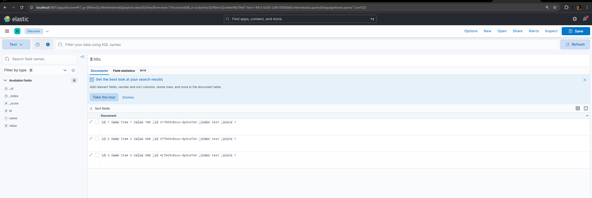

# Лабораторна робота 3

## Завдання

* Написати програму формування пакетного файлу для завантаження в Elasticsearch на основі сформованого на попередньому занятті файлу в форматі JSON.
* Встановити на комп’ютері утиліту curl (http://curl.se) і вивчити склад і значення її основних параметрів.
* Ознайомитися зі складом і змістом CRUD-операцій в Elasticsearch.

## Результати

