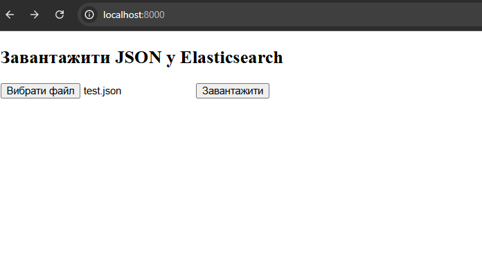

# Лабораторна робота 4

## Завдання

* Забезпечити функціонування на комп’ютері (сервері) засобів інтерактивної взаємодії з користувачем (наприклад, CGI).
* Ознайомитися із основними можливостями пошуку і фільтрації в Elasticsearch.
* Ознайомитись з основами HTML-розмітки.

## Результати

